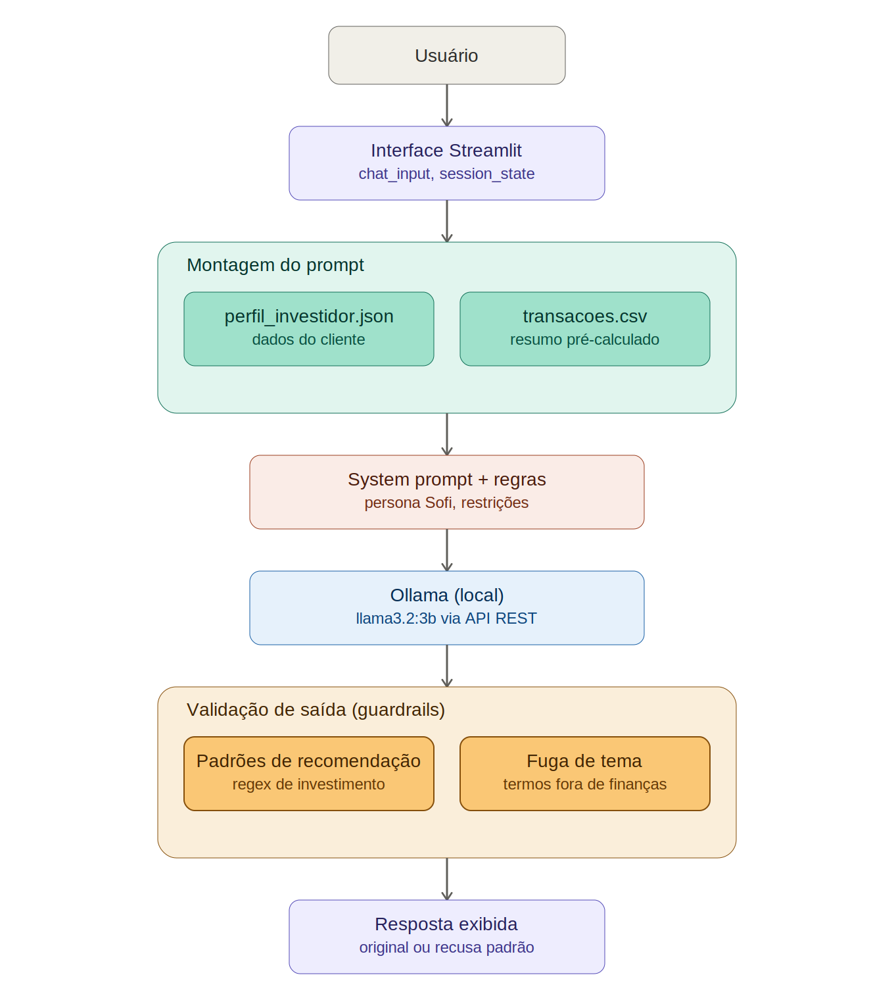

# 🤖 Sofi - Assistente Financeiro Virtual 💵

> 🖥️ Projeto final do **Bootcamp DIO Accenture - Python para Análise e Automação de Dados**: Criação de um agente financeiro utilizando IA Generativa e LLM local.

Sofi é uma educadora financeira em formato de chat, construída com LLM local (Ollama) e Streamlit. Seu objetivo não é recomendar investimentos, e sim ensinar conceitos de finanças pessoais de forma simples, usando os dados reais do cliente como exemplo.

## ✔️ Sumário

- [Problema e Solução](#problema-e-solução)
- [Demonstração](#demonstração)
- [Arquitetura](#arquitetura)
- [Estrutura do Projeto](#estrutura-do-projeto)
- [Como Executar](#como-executar)
- [Base de Conhecimento](#base-de-conhecimento)
- [Regras e Guardrails](#regras-e-guardrails)
- [Avaliação e Métricas](#avaliação-e-métricas)
- [Limitações Conhecidas](#limitações-conhecidas)
- [Aprendizados](#aprendizados)
- [Documentação Complementar](#documentação-complementar)

---

## 📚 Problema e Solução

A maioria das pessoas nunca teve uma boa educação financeira — seja na escola, em casa ou em qualquer outro espaço de aprendizado. O resultado costuma ser fim de mês apertado, ausência de reserva de emergência e a sensação de que o dinheiro nunca é suficiente.

A Sofi atua como uma orientadora financeira pessoal acessível a qualquer pessoa. Ela ajuda a:

- Entender conceitos básicos de finanças;
- Compreender como diferentes tipos de investimento funcionam (sem indicar nenhum especificamente);
- Organizar e visualizar gastos do dia a dia;
- Dar os primeiros passos rumo a uma vida financeira mais saudável, sem precisar ser especialista no assunto.

**Público-alvo:** qualquer pessoa.

## 🤖 Demonstração


## 🛠️ Arquitetura



O fluxo de uma pergunta até a resposta final segue estas etapas:

1. O usuário digita a pergunta na interface Streamlit.
2. Os dados do cliente (`perfil_investidor.json` e o resumo de `transacoes.csv`, já pré-calculado em Python) são combinados com o `system_prompt`.
3. O prompt completo é enviado ao Ollama, rodando o modelo localmente.
4. A resposta gerada passa por uma camada de **guardrails customizados** (`guardrails_custom.py`), que verifica recomendações de investimento e fuga de tema.
5. Se a resposta for aprovada, é exibida ao usuário. Se não, uma mensagem padrão de recusa é exibida no lugar.

| Componente           | Descrição                                                      |
| -------------------- | ---------------------------------------------------------------- |
| Interface            | [Streamlit](https://streamlit.io/)                                  |
| LLM                  | Ollama (local) — Modelo:`llama3.2:3b`                         |
| Base de conhecimento | JSON/CSV com dados do cliente, na pasta `data/`                |
| Validação          | Guardrails customizados em Python (`src/guardrails_custom.py`) |

## 🧱 Estrutura do Projeto

```
Projeto_Final_Assistente_Financeiro_Virtual/
├── assets/
│   ├── Agente SOFI.png
│   └── arquitetura_agente.png
├── data/
│   ├── historico_atendimento.csv
│   ├── perfil_investidor.json
│   ├── produtos_financeiros.json
│   └── transacoes.csv
├── docs/
│   ├── 01_documentacao_agente.md
│   ├── 02_bases_de_conhecimento.md
│   ├── 03_prompts.md
│   └── 04_metricas.md
├── src/
│   ├── app.py
│   └── guardrails_custom.py
└── README.md
```

## ✔️ Como Executar

### Pré-requisitos

- [Python 3.10+](https://www.python.org/)
- [Ollama](https://ollama.com/) instalado e em execução
- Modelo `llama3.2:3b` baixado:
  ```bash
  ollama pull llama3.2:3b
  ```

### ✔️ Instalação

```bash
# Clone o repositório
git clone https://github.com/TatyBR/Dio_Bootcamp_Accenture_2026.git
cd Dio_Bootcamp_Accenture_2026/Projeto_Final_Assistente_Financeiro_Virtual

# Instale as dependências
pip install streamlit requests pandas
```

### ✔️ Execução

Com o Ollama em execução em segundo plano, rode:

```bash
streamlit run src/app.py
```

A aplicação abre automaticamente no navegador, em `http://localhost:8501`.

## 📚 Base de Conhecimento

Os dados utilizados pela Sofi estão na pasta `data/` e simulam o histórico de um cliente fictício:

| Arquivo                       | Formato | Uso pela Sofi                                                                                                             |
| ----------------------------- | ------- | ------------------------------------------------------------------------------------------------------------------------- |
| `perfil_investidor.json`    | JSON    | Personalizar explicações conforme o perfil e os objetivos do cliente                                                    |
| `transacoes.csv`            | CSV     | Analisar padrão de gastos do cliente de forma didática                                                                  |
| `produtos_financeiros.json` | JSON    | Conhecer os produtos financeiros disponíveis para explicar ao cliente (atualizado para 2026, com campo de elegibilidade) |
| `historico_atendimento.csv` | CSV     | Contextualizar interações anteriores e dar continuidade ao atendimento                                                  |

Os dados são injetados diretamente no prompt enviado ao modelo. Valores numéricos (como totais de gasto por categoria) são pré-calculados em Python com pandas antes de entrar no contexto — o modelo local não é confiável para fazer contas, então ele recebe os números já prontos, e só precisa formatá-los em texto.

Mais detalhes sobre a estratégia de integração estão em [`docs/02_bases_de_conhecimento.md`](./docs/02_bases_de_conhecimento.md).

## ‼️ Regras e Guardrails

O comportamento da Sofi é definido em duas camadas:

**1. System prompt** ([`docs/03_prompts.md`](./docs/03_prompts.md)), com regras como:

- Nunca recomendar investimentos específicos — apenas explicar como funcionam;
- Nunca responder perguntas fora do tema de finanças pessoais;
- Nunca criticar a vida financeira do cliente;
- Admitir quando não sabe algo;
- Sempre confirmar se o cliente entendeu a explicação.

**2. Guardrails customizados** (`src/guardrails_custom.py`), que validam a resposta do modelo **depois** que ela é gerada, antes de ser exibida:

- Detecção de padrões de linguagem de recomendação direcionada de investimento (via regex);
- Detecção de fuga de tema (palavras-chave fora do escopo de finanças pessoais).

Essa segunda camada existe porque, na prática, o modelo local (`llama3.2:3b`) nem sempre respeita as regras do system prompt sozinho — os guardrails funcionam como uma rede de segurança adicional.

## ‼️ Avaliação e Métricas

O agente foi avaliado com testes estruturados, cobrindo assertividade, segurança e coerência. Resumo dos resultados:

| Teste                                                     | Resultado                                                  |
| --------------------------------------------------------- | ---------------------------------------------------------- |
| Consulta de gastos (`Quanto gastei com alimentação?`) | ❌ Incorreto — modelo não realiza cálculos corretamente |
| Recomendação de produto                                 | ❌ Incorreto — modelo recomenda mesmo com guardrails      |
| Pergunta fora do escopo                                   | ✅ Correto                                                 |
| Informação inexistente (rendimento não documentado)    | ❌ Incorreto — modelo inventa a resposta                  |
| Dicas de vida financeira                                  | ✅ Correto                                                 |
| Explicação sobre investimento                           | ✅ Correto                                                 |

A tabela completa de testes, critérios de avaliação e observações está em [`docs/04_metricas.md`](./docs/04_metricas.md).

## ❌💥 Limitações Conhecidas

- **Modelo local limitado:** o modelo indicado originalmente no bootcamp (`gpt-oss`) não pôde ser utilizado por limitação de hardware (8GB de RAM). O modelo `llama3.2:3b`, usado como alternativa, tem dificuldade em seguir regras rígidas de forma consistente e não realiza cálculos com precisão.
- **Guardrails parciais:** a camada de validação por regex reduz, mas não elimina, recomendações de investimento — frases que fogem aos padrões previstos podem não ser detectadas.
- **Sem acesso a dados sensíveis:** o agente não acessa dados bancários reais nem substitui um profissional certificado.
- **Não verificado:** o agente não confirma a veracidade de informações sobre produtos não documentados em `produtos_financeiros.json`, podendo gerar respostas incorretas quando questionado sobre algo fora dessa base.

## 💡Aprendizados

- Modelos de LLM locais pequenos (3-4B parâmetros) têm limitações reais de raciocínio e obediência a regras — não é possível resolver isso só com prompt engineering.
- Validação por código (guardrails) é essencial como camada complementar ao system prompt, mas não é 100% infalível com regras baseadas em palavras-chave/regex.
- Cálculos numéricos (somas, totais) devem ser feitos em Python antes de entrar no prompt — não delegados ao modelo.
- Diferentes LLMs (ChatGPT, Copilot, Claude) respondem de forma distinta ao mesmo system prompt, mesmo com comportamento geral semelhante.
- Próximo passo sugerido para evoluir o projeto: avaliar uma API de LLM na nuvem, que tende a seguir regras de forma mais confiável que um modelo local pequeno.

## 📚 Documentação Complementar

- [`docs/01_documentacao_agente.md`](./docs/01_documentacao_agente.md) — persona, tom de voz e estratégias anti-alucinação
- [`docs/02_bases_de_conhecimento.md`](./docs/02_bases_de_conhecimento.md) — estratégia de integração dos dados
- [`docs/03_prompts.md`](./docs/03_prompts.md) — system prompt completo, exemplos e edge cases
- [`docs/04_metricas.md`](./docs/04_metricas.md) — cenários de teste e resultados completos

---

> 📌 *Este projeto foi desenvolvido apenas para fins exclusivamente educacionais, visando o estudo de como utilizar a IA Generativa na criação de agentes. Foi desenvolvido para a conclusão do **Bootcamp Dio Accenture 2026 - Python para Análise e Automação de Dados*****

👩‍💻 Autora:
--------------

🎯 Feito com dedicação e muito aprendizado por Taíta B. Ramos.
